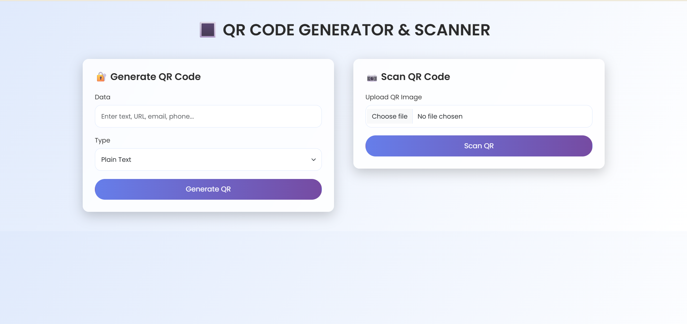
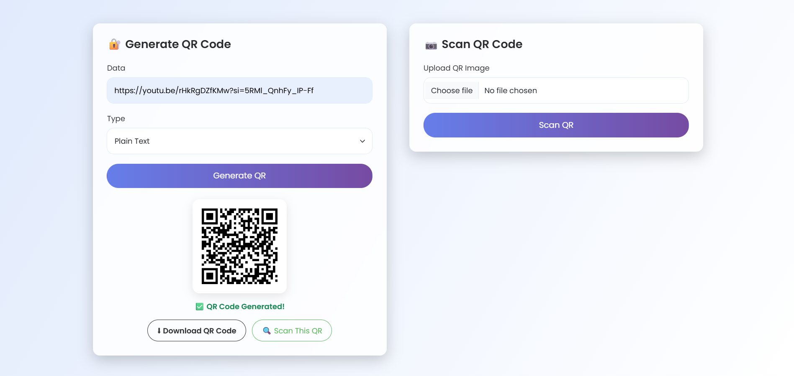
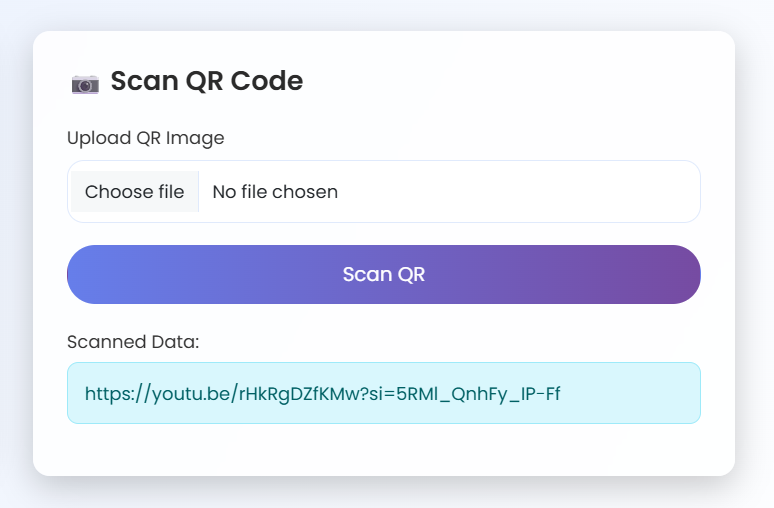

# QR Code Generator and Scanner

A web-based application built with Flask that allows users to generate various types of QR codes and scan them to view the embedded information. The application also features an attractive and responsive UI designed with CSS and provides the ability to download generated QR codes.

## Features

- **QR Code Generation**: Generate QR codes for various data types such as text, URLs, contact info, and more.
- **QR Code Scanning**: Scan QR codes to extract and display the encoded data.
- **Download QR Codes**: Option to download generated QR codes.
- **Responsive Design**: Fully responsive design that works across devices of all sizes.
- **Impressive UI**: An interactive and visually appealing user interface with custom styling.

## Screenshots

Here are some screenshots of the app:


*QR Code Generator and Scanner Interface*


*QR Code Generator Interface*


*QR Code Scanner Interface*

## Technologies Used

- **Frontend**: HTML, CSS, JavaScript 
- **Backend**: Python (Flask)
- **QR Code Generation**: `qrcode` Python library
- **QR Code Scanning**: `pyzbar` Python library

## Installation

Follow these steps to set up the project locally:

1. **Clone the repository**:
   ```bash
   git clone https://github.com/your-username/qr-code-generator-scanner.git
   cd qr-code-generator-scanner

2. **Create a virtual environment**:
   ```bash
   python3 -m venv venv

3. **Activate the virtual environment**:
   ```bash
   venv\Scripts\activate
   
4. **Install the required dependencies**:
   ```bash
   pip install -r requirements.txt
5. **Run the Flask application**:
   ```bash
   python app.py
6. **Access the app**:
   Open a web browser and go to http://127.0.0.1:5000/ to start using the app.


